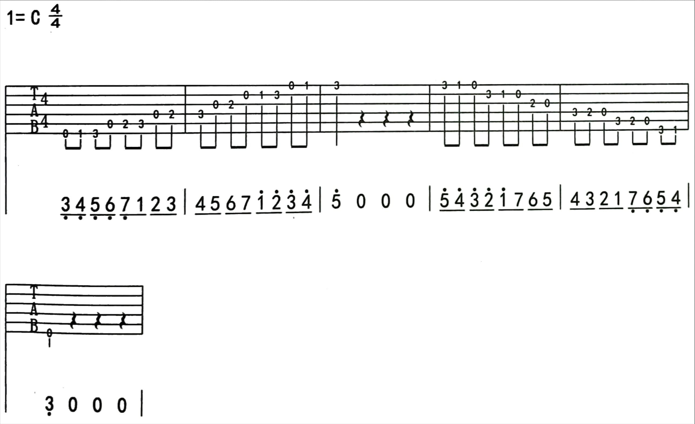

# 果木浪子的吉他教程

`（iTan吉他学院版）`

- 第1课 吉他自学指南

- 第2课 认识吉他

  > 由下而上，1至6弦，从左到右，一二三品。

- 第3课 如何给吉他调音

  > 调音器。
  >
  > 1-6 = EBGDAE = 一笔记的阿姨。

- 第4课 拨弦方法

  > 右手拇指管654弦，食指中指无名指管321弦。

- 第6课 七音阶练习

  > 左手大拇指挂在琴颈上，下方四指从食指到小指分别称1234指。
  >
  > 六线(TAB)谱相当于把吉他头朝左对面立起来看弦。数字代表弹几品，0 代表弹空弦。
  >
  > - 1 = 5弦三品
  > - 2 = 4弦空弦
  > - 3 = 4弦二品
  > - 4 = 4弦三品
  > - 5 = 3弦空弦
  > - 6 = 3弦二品
  > - 7 = 2弦空弦
  > - 高音1 = 2弦一品

- 第7课 三分钟学会小乐曲

  > 小蜜蜂：533 422 1234555 5333 4222 13551, 2222234 3333345 ...
  >
  > 弹 13551 左手可不松。

- 第8课 三个和弦

  > C大7，D9/D挂2，Em/小三。
  >
  > 和弦图相当于把吉他对面立起来看弦和品。
  >
  > 叉 = 该弦不弹，◯ = 弹空弦。

- 第9课 星语心愿弹唱教学

  > 调门：我 = C大7四弦，要 = C大7三弦。
  >
  > **C大7 + D9 + Em** = **5323 4323 43231**。（←之前一直写错 53231）
  >
  > D9的2弦用小指按。

- 第10课 画心弹唱教学

  > 调门：看不 = 四弦空弦，穿 = C大7四弦。
  >
  > C大7 + D9 + Em|**G(副歌)** = 5323 4323 **6323 1323**。（←之前一直弹错 5321 4321）
  >
  > 琶弦用拇指压食指拨。

- 第11课 半音阶练习

  > 爬格子。每个音与音之间都是半音关系（半音阶）。
  >
  > 入门：从3弦五品开始练习。五、六、七、八品。右手食指和中指交替弹奏。
  >
  > - 靠近品柱（到位），手指站立（指尖）。
  > - 弹和弦不能碰弦，爬格子练习可碰。
  > - 左手拇指，指肚不偏不倚，自然放在琴上，可上移下移（尽量居中），但不可点琴。
  > - 声音饱满清晰。
  > - 保留指（指但按下，不再松开，直到一轮弹完）。
  > - **不要追求速度。** → 求稳定。
  > - 手指勿起太高。
  >
  > 进阶：五、六、七、八品，1弦到6弦，6弦到1弦。
  >
  > 终极：完整练习，坚持每天，至少一遍。
  >
  > - **慢练快打，先求慢，再求快，实打实地进步不留隐患。**
  >
  >   负基础不如零基础。

  - **3弦的五六七八品。**

  - **1-6弦的五六七八品，6-1弦的五六七八品。**

  - **1-6弦的一二三四品，6-1弦的二三四五品。**

    **1-6弦的三四五六品，6-1弦的四五六七品。**

    **1-6弦的五六七八品，6-1弦的六七八九品。**

    **1-6弦的九八七六品，6-1弦的八七六五品。（不保留指）**

    **1-6弦的七六五四品，6-1弦的六五四三品。（不保留指）**

    **1-6弦的五四三二品，6-1弦的四三二一品。（不保留指）**
    
  - 尝试跟着 **节拍器** 练习。

  - 左手拇指只要正（保持竖直），即使上边出点头儿也没关系。

    爬格子拇指就是要用力的，关键是不能弯曲拇指用指尖顶着。

    拇指竖直，但是不要抓琴太紧，手掌送出，与琴颈留出空隙。

    **右手拨弦时，大拇指放在拨弦上面紧邻的那根弦上，用于相对定位。**

    小拇指练打弦，把弦打出声来。**→小拇指肌肉力量出来的时候才能控制自如。**

    总是误触弦，按弦弹上下两弦。**→爬格子阶段暂时不用那么严格，坚持练习。**

  - 其实爬格子这件事儿，<u>**每次练习量不必过分，坚持练习是最重要的。**</u>

    休息也是必须的，每次休息过后重新拿起吉他，一定会感觉到进步。

- 第11课+ 兰花草弹唱教学

  > 变调夹三品。
  >
  > 前奏 Am = 4/2/2/2空、3/1、2空/3空 + 琶5→1
  >
  > Am = 5323 1323
  >
  > Em = 6323 1323
  >
  > Em + Am = 6323 5323

- 第12课 C调mi型音阶

  > 简谱，音符上下无点儿 = 中音。
  >
  > 上方有点儿 = 高音，下方有点儿 = 低音。
  >
  > 上有两点儿 = 倍高音，下有两点儿 = 倍低音。
  >
  > 主要练左手，右手正常拨弦，或用半音阶指法，或用拇指指甲模拟拨片。
  >
  > 除了指法，还要看音，心中模唱。
  >
  > 目标是：**指哪儿打哪儿**。需要什么音，就能迅速定位弹出什么音。
  >
  > 左手拇指允许靠上，手型可相对自由。
  >
  > 练熟了之后，可以尝试去弹一些旋律。
  >
  > **切忌心急，不要求快。弹快是很容易的，只要你练，就能做到。**
  >
  > - [余怀民：我用慢来改变世界](https://v.youku.com/v_show/id_XNzYyMDI4NTIw)
  >
  > 前三品左手用指：1、2、3 指。本次练习尚未涉及小指。

  

- 第13课 Am和弦与扫弦

  ……

